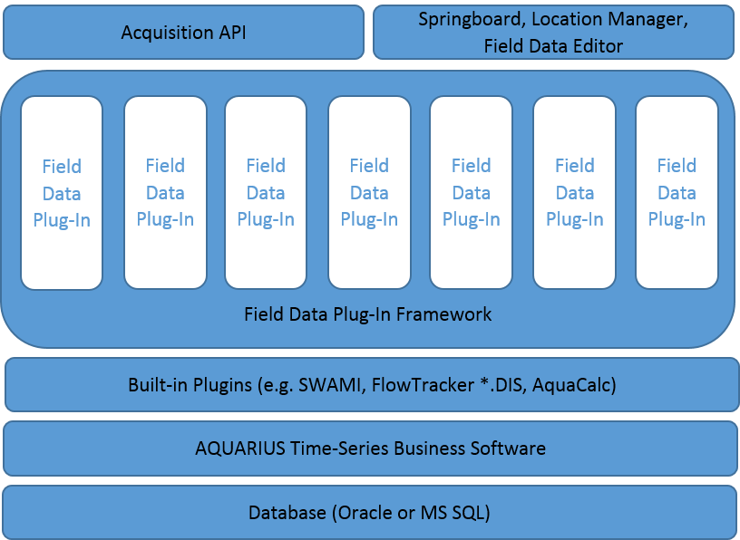
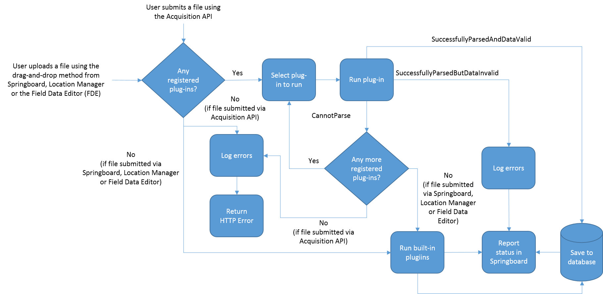
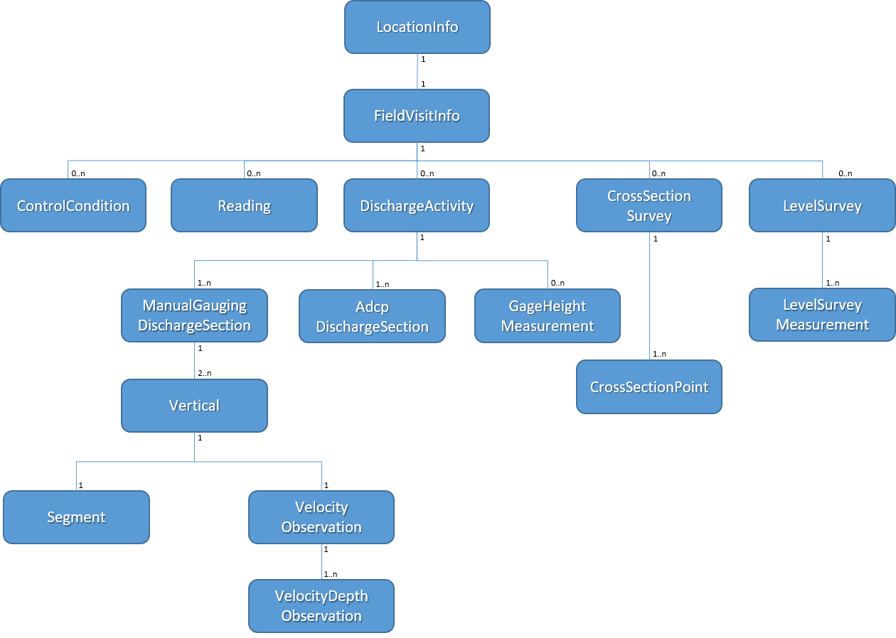
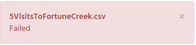
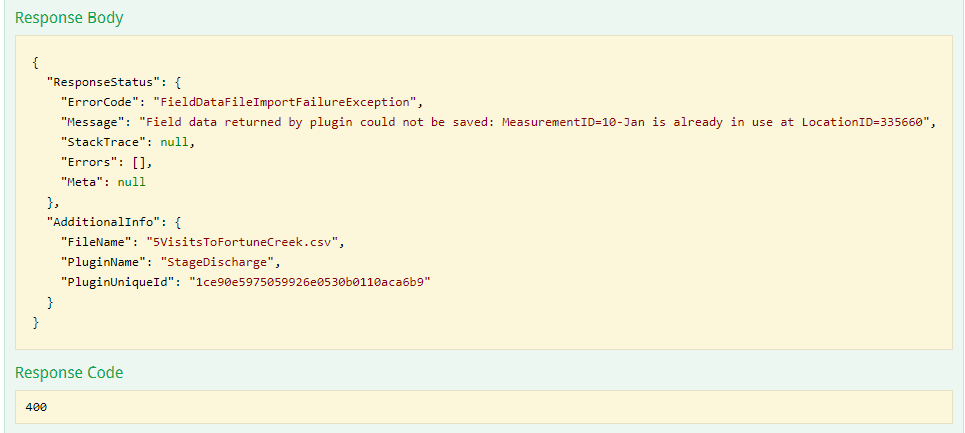

# AQUARIUS Time-Series Developer Guide: Field Data Plug-In Framework

# About This Guide

A Field Data Plug-In Framework has been added to AQUARIUS Time-Series.

A Field Data Plug-In Framework SDK is now included with the AQUARIUS Time-Series Server installation package. Integrators can use this SDK to extend AQUARIUS Time-Series by creating custom field data plug-ins to parse custom field data files.

After installing the plug-in on the AQUARIUS Time-Series Server and registering it with the Field Data Plug-In Framework, users can import their proprietary/custom field data files to the AQUARIUS Time-Series system using the available drag-and-drop upload method from Springboard, Location Manager, and the Field Data Editor, or by using the AQUARIUS Acquisition API.

This guide provides guidance for developing custom field data plug-ins for AQUARIUS Time-Series.

If you would like to see more examples of field data plug-ins, please visit our [**Examples Repository**](https://github.com/AquaticInformatics/Examples/tree/master/TimeSeries/PublicApis/FieldDataPlugins) on GitHub.

# Overview

Figure 1 illustrates how the Field Data Plug-In Framework fits into the overall architecture of AQUARIUS Time-Series.

The Framework is called when:
* A user utilizes the available drag-and-drop upload method from Springboard, Location Manager, or the Field Data Editor 

OR

* A program calls the **PostFieldDataAttachment** operation from the AQUARIUS Acquisition API (http://\<yourserver\>/AQUARIUS/Acquisition/v2/location/{LocationUniqueId}/visits/uploads/plugins).

<b>Figure 1: Architecture Overview</b>

Field data plug-ins are dynamically loaded at runtime and run within its own AppDomain. Each plug-in is sand-boxed, running locally and protected from other areas of the system.

# Control Flow

Figure 2 illustrates the control flow after a user uploads a field data file to the Framework.

 

<b>Figure 2: Control Flow</b>

Plug-ins are registered with the Framework and given a priority. The priority determines the order that the Framework runs the plug-ins to parse the field data file. When a field data file is submitted to the Framework, the file is passed to each parser, in ascending priority order. Each parser returns one of the following statuses:

* **CannotParse.** The plug-in could not parse the file. The Framework will pass the file to the next highest priority plug-in.  If the file is submitted through the drag-and-drop interface in Springboard, Location Manager, or the Field Data Editor, and there are no more registered plug-ins, then the Framework passes the built-in plug-ins (e.g., SWAMI, FlowTracker *.DIS, AquaCalc) to parse.  If the file is submitted through the AQUARIUS Acquisition API, an HTTP error is returned.
* **SuccessfullyParsedButDataInvalid.** The plug-in parsed the file but failed to process the data.  The framework will exit with an error. The error will be logged to a log file (*FieldDataPluginFramework.log*) and a "Failed" status will be reported in Springboard or an HTTP error is returned in the AQUARIUS Acquisition API.
* **SuccessfullyParsedAndDataValid.** The plug-in parsed the file and processed the data without error. The framework will try to save the field data to the database and the save status will be reported below the drag-and-drop area in Springboard, Location Manager or the Field Data Editor (FDE).

# Data Model

The Framework SDK provides a number of data objects. Your plug-in is responsible for mapping the contents of a field data file to one or more of these data objects. The Framework uses these data objects to save field data to the AQUARIUS Time-Series Server.

Figure 3 illustrates the data objects and their relationships, as currently supported by the Framework.

<b>Figure 3: Data Object Diagram</b>

**LocationInfo** is an immutable object. When a plug-in is called without location context, as is the case when data files are submitted through Springboard drag-and-drop, the plug-in can use the **IFieldDataResultsAppender** to look-up a location by its identifier or unique ID. We recommend that plug-ins and their field data file reference locations by its unique ID for the following reasons:

* The unique ID is a string identifier assigned by AQUARIUS Time-Series.  It is guaranteed to be unique.
* The location identifier can be changed from Springboard or by using the Provisioning API.  When this happens, any field data that references the location identifier needs to be updated or AQUARIUS Time-Series will throw a LocationNotFound exception.
* If the AQUARIUS Time-Series Server has an Oracle database, the location identifier is case sensitive. In this instance, locations with different capitalization can co-exist as separate locations (e.g., "My Location" vs. “my location”). This introduces fragility in the field data because it must be precise when identifying its location context.

All Framework SDK data objects require timestamps specified as **DateTimeOffset**. However, some plug-ins may process field data containing timestamps that do not include an UTC-offset.  Plug-ins can use these timestamps to construct a **DateTimeOffset** object by combining it with the **UtcOffset** property in **LocationInfo**.

Similarly, **FieldVisitInfo** is an immutable object. It is created when the plug-in uses the **IFieldDataResultsAppender** to add an instance of a **FieldVisitDetails** object to a location.

There are factory methods to create an instance of **CrossSectionSurvey**, **DischargeActivity**, and **ManualGaugingDischargeSection** object. Plug-ins should also use **IFieldDataResultsAppender** to add **Reading**, **CrossSectionSurvey**, **LevelSurvey** and **DischargeActivity** objects to the **IFieldVisitInfo**.

Some enumerated types in the Framework SDK default to "Unknown" value.  When creating data objects that have these enumerated types as properties, the properties should be set to “Unspecified” value if there is no other appropriate value for it so that the data displays correctly in the Field Data Editor. For example, when creating an instance of **ManualGaugingDischargeSection**,

    //These enums fail if you use "Unknown".  “Unspecified” is what should be used
    //when nothing else fits;
    var factory = new ManualGaugingDischargeSectionFactory(UnitSystem);
    var manualGauging = factory.CreateManualGaugingDischargeSection(measurementPeriod, 
                                                                    results.TotalDischarge.Value);
    
    manualGauging.MeterSuspension = MeterSuspensionType.Unspecified;
    manualGauging.DeploymentMethod = DeploymentMethodType.Unspecified;

If these properties are left as the default "Unknown" value, the Framework will save the field data, but when the data is viewed in the Field Data Editor, it will show an invalid icon (orange exclamation mark) by the discharge value. Unfortunately, this value cannot be corrected in the Field Data Editor.

# Setting up a Development Environment

Plug-ins are 64-bit libraries written using .NET Framework 4.7.  If the .NET Framework 4.7 developer pack is not already installed, it can be downloaded [here](https://www.microsoft.com/en-us/download/details.aspx?id=55170).

The Field Data Plug-In Framework SDK is found on the AQUARIUS Time-Series Server at: 

**{AppInstallRoot}\\FieldDataPlugins\\Library**

where {AppInstallRoot} is the installation root of the AQUARIUS Time-Series Server. The default installation root is %ProgramFiles%\\Aquatic Informatics\\AQUARIUS Server.

The Framework SDK (plug-in interface and data objects) is defined in the following library: *FieldDataPluginFramework.dll*.  This library must be added as a reference in your plug-in project.

# Writing a Field Data Plug-In

A plug-in implements the interface, **IFieldDataPlugin**:

    namespace FieldDataPluginFramework
    {
        public interface IFieldDataPlugin
        {
            ParseFileResult ParseFile(Stream fileStream,
                                      IFieldDataResultsAppender fieldDataResultsAppender, 
                                      ILog logger);
            ParseFileResult ParseFile(Stream fileStream, 
	                                  LocationInfo targetLocation, 
	                                  IFieldDataResultsAppender fieldDataResultsAppender, 
	                                  ILog logger);
        }
    }

In **IFieldDataPlugin**, there are two *ParseFile* method signatures:

1. Global (i.e. no location context)
    1. Called by the Framework when Springboard is used to import a data file;
    2. Data file must contain a reference to the location that owns the field data;
2. With location context (i.e. targetLocation)
    1. Called by the Framework when LocationManager, the Field Data Editor or AQUARIUS Acquisition API is used to import a data file;
    2. Field data will be created in the targetLocation.  If the data file references a location, it must match the targetLocation or the field data will not be imported.

Each *ParseFile* method returns a **ParseFileResult** object.  **ParseFileResult** has static constructors to create an instance to represent the plugin status (SuccessullyParsedAndDataValid, SuccessfullyParsedButDataInvalid, CannotParse).

## Tips

1. Plug-ins should not access the network. The framework runs plug-ins locally in a sand-boxed environment.
2. Plug-ins should be thread safe. In the future, the Framework will call plug-ins concurrently from multiple threads or processes.
3. Plug-ins should only contain managed code. Aquatic Informatics will not provide developer support for plug-ins containing unmanaged code.
4. Plug-ins should be able to process field data files in less than **one second**. In the future, the Framework will terminate long-running plug-ins.
5. Plug-ins process any file that can be uploaded to the AQUARIUS Time-Series Server (through drag-and-drop in Springboard, Location Manager and the Field Data Editor), including images and video files. Plug-ins should try to quickly inspect the start of the file stream and return the **CannotParse** status if the content does not make sense.

# Parsing the Field Data File

A plug-in is responsible for reading the field data file and mapping its contents to one or more of the data objects provided by the Framework SDK (*FieldDataPluginFramework.dll*). The *ParseFile* method provides a *Stream* as one of its inputs.  The *Stream* is opened by the Framework and contains the memory stream byte representation of the field data file. Below is an example of how the contents of the stream are read (in C#):

    public void ReadFile(Stream stream)
    {
        using (var reader = CreateStreamReader(stream, Encoding.UTF8))
        {
            //Read data from file.
        }
    }

    private static StreamReader CreateStreamReader(Stream stream, Encoding fileEncoding)
    {
        const int defaultByteBufferSize = 1024;
        //NOTE: Make sure to set leaveOpen property on StreamReader so the Stream’s
	    //Dispose() method is not called when StreamReader.Dispose() is called.
        //Framework will take care of closing the Stream.

        return new StreamReader(fileStream, fileEncoding,
   		                        detectEncodingFromByteOrderMarks: true,
   		                        bufferSize: defaultByteBufferSize, leaveOpen: true);
    }

# Logging

The Field Data Plug-In Framework log messages are written to the log file, *FieldDataPluginFramework.log*, found on the server at:

**%ProgramData%\\Aquatic Informatics\\AQUARIUS\\Logs**

Each plug-in is provided a reference to an **ILog** object when its **ParseFile** method is called. The **ILog** object writes log messages from the plug-in to the *FieldDataPluginFramework.log*. It is important to note that since both the Framework and plug-in log to *FieldDataPluginFramework.log*, error messages from a plug-in are logged as warnings because plug-in errors are not the same severity as errors from the Framework (Framework errors indicate problems saving field data to the AQUARIUS Time-Series Server).

The log messages written to *FieldDataPluginFramework.log* are designed to be easily parsed by log analytic tools, such as LogStash.

# Installing and Registering your Plug-In

To install and register your plug-in:

1. On the AQUARIUS Time-Series Server, navigate to the folder:
**{AppInstallRoot}\\Aquatic Informatics\\AQUARIUS Server\\FieldDataPlugins**
2. In the FieldDataPlugins folder, create a sub-folder with a name that matches your plug-in’s name.
3. Copy your plug-in and its dependencies into the sub-folder.
4. Register your plug-in with the AQUARIUS Time-Series Server using the **POST /fielddataplugins** endpoint in the Provisioning API (http://\<yourservername\>/AQUARIUS/Provisioning/v1). The AQUARIUS Time-Series Server is not aware that your plug-in is installed until it is registered. The POST endpoint requires the following parameters:
    1. PluginFolderName – the name of the sub-folder;
    2. AssemblyQualifiedTypeName – the type name and display name of your plug-in assembly, which allows the Framework to load your plug-in using reflection.  The minimum specification of an AssemblyQualifiedTypeName is *{classTypeName}, {assemblyName}*. 
    3. PluginPriority – the unique number representing the order that the Framework will run your plug-in will be run relative to other registered plug-ins (the framework runs plugins in ascending priority order). The highest priority plug-in has PluginPriority = 1;
5. When a plug-in is registered, it is assigned a unique ID. The plug-in’s unique ID will be used to unregister the plug-in from the Framework.

For example, you have installed your plug-in assembly on the AQUARIUS Time-Series Server at %ProgramFiles%\\Aquatic Informatics\\AQUARIUS Server\\FieldDataPlugins\\MyPlugin\\MyFirstPlugin.dll.  The assembly contains a class, Foo.FieldDataPlugin that implements the IFieldDataPluginInterface. To register your plug-in, you would call **POST /fielddataplugins** in Provisioning API with the following input parameters:

* PluginFolderName = MyPlugin
* AssemblyQualifiedTypeName = Foo.FieldDataPlugin, MyFirstPlugin
* PluginPriority = 2500

## Tips

1. To update the registration of your plug-in (e.g., change the plug-in priority), you need to un-register and re-register your plug-in.
2. We recommend selecting plug-in priorities so that there is a gap between each priority.  This makes it easier to insert new plug-ins without having to re-order the priorities of every registered plug-in.

For example, your AQUARIUS Time-Series Server has two plug-ins registered so that PluginA is assigned priority = 1 and PluginC is assigned priority = 3. 

Now, you would like to install a new plugin, PluginB, so that it is the second plugin that will be run by the framework. To do so, you need to un-register and re-register PluginC with priority = 3 so that you can register PluginB with priority = 2.

However, if PluginA and PluginB were registered so that PluginA is assigned priority = 100 and PluginC is assigned priority = 300, you do not need to change the priority of PluginC; you only need to assign PluginC a priority between 100 and 300.

# Unregistering your Plug-In

A plug-in can be unregistered from the Framework using the **DELETE /fielddataplugins** endpoint in Provisioning API.  The delete endpoint only removes the Framework’s awareness of the plug-in (i.e. when a field data file is submitted, the framework will not run the plug-in), it does not delete the plug-in’s libraries from the AQUARIUS Time-Series Server.

To unregister a plug-in, you need to refer to the plug-in by its unique ID. A plug-in’s unique id can be found by using the **GET /fielddataplugins** endpoint in Provisioning API to retrieve a list of all plug-ins registered with the Framework.

# Debugging your Plug-In

After installing and registering your plug-in on the AQUARIUS Time-Series Server, you can test and debug your plug-in by using the drag-and-drop upload method, (available from Springboard, Location Manager or the Field Data Editor), to upload your test field data files. If there is a problem with your plug-in, the feedback from these drag-and-drop interfaces is not very informative:

<b>Figure 4: Drag-and-drop Error Message</b>

To help debug problems with your plug-in, look in *FieldDataPluginFramework.log* to find more details about why the data failed to be saved to the AQUARIUS Time-Series Server.

Another approach to testing and debugging your plug-in is to use the AQUARIUS Acquisition API, which provides more details in its response to help you quickly diagnose problems:

<b>Figure 5: AQUARIUS Acquisition API Response</b>

However, we still recommend that you refer to *FieldDataPluginFramework.log* to find more details about your plug-in failure.

Additionally, the Aquatic Informatics Example repo on GitHub provides the PluginTester.exe as a tool to help debug your plug-in outside of the AQUARIUS Time-Series Server environment.  The Plug-in Tester can be found [here](https://github.com/AquaticInformatics/Examples/tree/master/TimeSeries/PublicApis/FieldDataPlugins/PluginTester).

In particular, when the **--json=AppendedResults.json** command line option is used, the JSON written to disk will include both the framework data models written by your plug-in and the correct AssemblyQualifiedTypeName to use during plug-in registration.

If you make changes to your plug-in, it is not necessary to unregister and re-register your plug-in with AQUARIUS Time-Series Server. Simply replace the existing plug-in library on the server with its newer version.

## Tips

1. Debugging your plug-in can be difficult if it throws any unhandled exceptions because these exception messages are logged to the *FieldDataPluginFramework.log* at the DEBUG log level.  By default, all AQUARIUS Time-Series Server logs are set to the INFO log level. To avoid this problem, we recommend that you write your own top-level exception handler that will log all exceptions to *FieldDataPluginFramework.log*.
2. The DEBUG log level is the most verbose log level supported. You can increase the logging verbosity for all AQUARIUS Time-Series Server logs by changing the log level from \<level value="INFO”\> to \<level value=”DEBUG”\> in %ProgramData%\\Aquatic Informatics\\AQUARIUS\\Logs\\RemotingAppender.config.  

This change will take effect immediately, without needing to re-start the server. While changing the log level to DEBUG can help with debugging, it will also fill up the log file with a large number of logging messages.

This will make reading the log files much more difficult, so you may want to resort to searching for specific terms instead of scanning the logs for errors. 

When you have finished debugging your plugin, we recommend that you restore the log level in RemotingAppender.config to the INFO log level.

