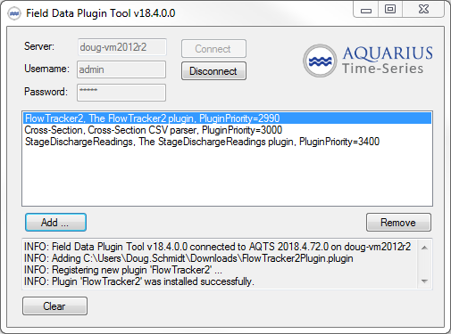
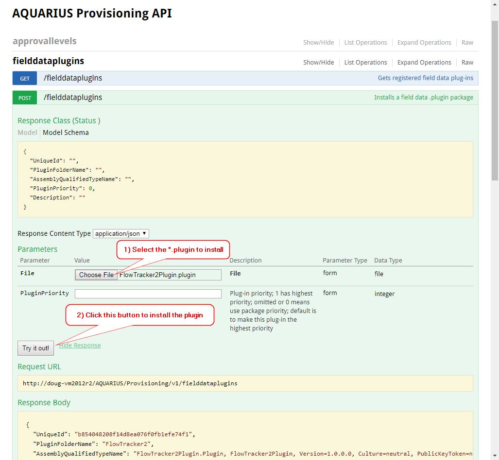

# FieldDataPluginTool

The Field Data Plugin tool is a utility that can be used to install and configure Field Data Plugins on your AQTS app server.

Download the latest version of the Field Data Plugin Tool [from the releases page](https://github.com/AquaticInformatics/aquarius-field-data-framework/releases/latest).

**Note:** Starting with AQTS 2018.4, the `FieldDataPluginTool.exe` is no longer required to install plugins. You can use the SwaggerUI page to install a plugin directly. The `FieldDataPluginTool.exe` still works with 2018.4+ systems, but it isn't strictly required.



## 2018.4+ Alternative: Install a plugin using the Swagger UI page

- First, log into AQUARIUS Springboard in your browser. Keep the Springboard tab open for the remainder of these steps.
- Open a new browser tab to `http://appserver/AQUARIUS/Provisioning/v1/swagger-ui/`
- Navigate to the `POST /fielddataplugins` operation
- Click the `Choose File` button and select the *.plugin file to install
- Click the `Try it out!` button to install the plugin



## 2018.4+ Alternative: Install a plugin using `curl`

You can also write a script to install a plugin.

Here is a `curl` command line to install a plugin located in `Downloads\Flowtracker2.plugin`.

```sh
$ curl -f -u username:password -F "upload=@Downloads/FlowTracker2.plugin" "http://appserver/AQUARIUS/Provisioning/v1/fielddataplugins"
{"UniqueId":"b854048208f14d8ea076f0fb1efe74f1","PluginFolderName":"FlowTracker2","AssemblyQualifiedTypeName":"FlowTracker2Plugin.Plugin, FlowTracker2Plugin, Version=1.0.0.0, Culture=neutral, PublicKeyToken=null","PluginPriority":990,"Description":"The FlowTracker2 plugin"}
```
- `-f` tells curl to fail if it does not receive a `2xx` HTTP status response.
- `-u username:password` sets the AQUARIUS credentials using HTTP Basic Authentication.
- `-F "upload=@Downloads/FlowTracker2.plugin"` is the path to the plugin file to upload. (Note that the path starts with `@`)

And to uninstall a plugin, you just need make a `DELETE` request to the `/Provisioning/v1/fielddataplugins/{UniqueId}` endpoint.

```sh
$ curl -f -u username:password -X DELETE "http://appserver/AQUARIUS/Provisioning/v1/fielddataplugins/b854048208f14d8ea076f0fb1efe74f1"
```

## `FieldDataPluginTool.exe` features
- Can add, remove, or change priority of field data plugins.
- Supports drag-and-drop installation of plugins.
- Operator confirmation is required before any changes are made.
- All actions are logged in the standard `%ProgramData%\Aquatic Informatics\AQUARIUS\Logs` folder in the `FieldDataPluginTool.log` file.

## Requirements

- The Time-Series server software must be running.
- **2018.3-or-older:** The tool must be run directly on an AQTS app server, running 2017.4-or-newer software.
- **2018.3-or-older:** Administrative access on the AQTS app server is required. Right-click `FieldDataPluginTool.exe` and select "Run as administrator"
- **2018.4-or-newer:** You can run the `FieldDataPluginTool.exe` from anywhere on the network, and no Administrative privileges are required.
