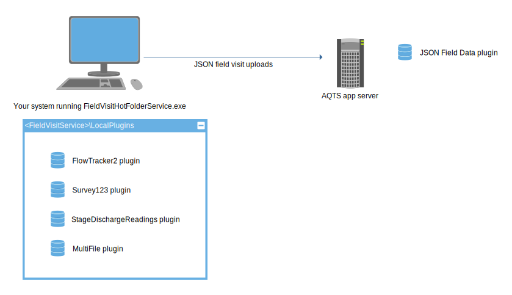
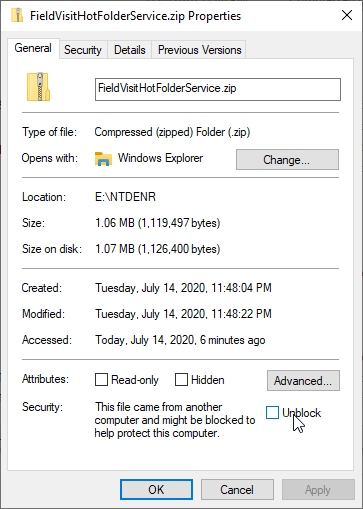
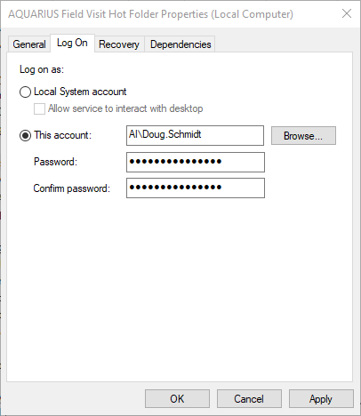
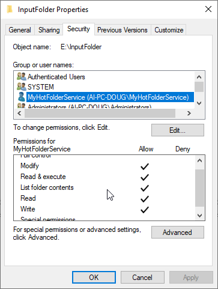

# Field Visit Hot Folder Service

Download the latest version of the Field Visit Hot Folder Service [from the releases page](https://github.com/AquaticInformatics/aquarius-field-data-framework/releases/latest).

The `FieldVisitHotFolderService.exe` tool is a .NET console tool which can:
- Run from the command line and Ctrl-C to exit,  or run as a Windows service.
- Monitor a hot folder path for new files
- Try to parse the files using a set of plugins running locally on the client
- Upload any created visits to AQTS using the [JSON plugin](../JsonFieldData/Readme.md)
- Supports a `/DryRun=true` option to see what would be done, without actually making any changes.
- Can export field visits and their attachments, for easy import into another AQTS system.

The service can be run on any Windows system with the .NET 4.7.2 runtime. This includes every Windows 10 desktop and Windows 2016 Server, and any Windows 7 desktop and Windows 2008 R2 Server with the most recent Windows Update patches.



## Compatibility Matrix

The `FieldVisitHotFolderService.exe` tool is tightly coupled to the specific framework version used to build it.

When you upgrade your AQTS app server, it is recommended that you use the most recent version of the hot folder service that matches your AQTS server version.

| AQTS Version | Latest compatible service version |
| --- | --- |
| AQTS 2021.4 Update 1+ | [v21.4.10](https://github.com/AquaticInformatics/aquarius-field-data-framework/releases/download/v21.4.10/FieldVisitHotFolderService.zip) |
| AQTS 2021.4 | [v21.4.0](https://github.com/AquaticInformatics/aquarius-field-data-framework/releases/download/v21.4.0/FieldVisitHotFolderService.zip) |
| AQTS 2021.3 Update 1+ | [v21.3.2](https://github.com/AquaticInformatics/aquarius-field-data-framework/releases/download/v21.3.2/FieldVisitHotFolderService.zip) |
| AQTS 2021.3 GA<br/>AQTS 2021.2<br/>AQTS 2021.1 | [v20.3.11](https://github.com/AquaticInformatics/aquarius-field-data-framework/releases/download/v20.3.11/FieldVisitHotFolderService.zip) |
| AQTS 2020.4<br/>AQTS 2020.3 | [v20.3.8](https://github.com/AquaticInformatics/aquarius-field-data-framework/releases/download/v20.3.8/FieldVisitHotFolderService.zip) |
| AQTS 2020.2 | [v20.2.5](https://github.com/AquaticInformatics/aquarius-field-data-framework/releases/download/v20.2.5/FieldVisitHotFolderService.zip) |
| AQTS 2020.1<br/>AQTS 2019.4 Update 1 | [v19.4.14](https://github.com/AquaticInformatics/aquarius-field-data-framework/releases/download/v19.4.14/FieldVisitHotFolderService.zip) |
| AQTS 2019.4 | [v19.4.0](https://github.com/AquaticInformatics/aquarius-field-data-framework/releases/download/v19.4.0/FieldVisitHotFolderService.zip) |
| AQTS 2019.3 | [v19.3.3](https://github.com/AquaticInformatics/aquarius-field-data-framework/releases/download/v19.3.3/FieldVisitHotFolderService.zip) |
| AQTS 2019.2 | [v19.2.2](https://github.com/AquaticInformatics/aquarius-field-data-framework/releases/download/v19.2.2/FieldVisitHotFolderService.zip) |
| AQTS 2019.1 | [v19.1.0](https://github.com/AquaticInformatics/aquarius-field-data-framework/releases/download/v19.1.0/FieldVisitHotFolderService.zip) |
| AQTS 2018.4 | [v18.4.21](https://github.com/AquaticInformatics/aquarius-field-data-framework/releases/download/v18.4.21/FieldVisitHotFolderService.zip) |

# Installing the service

- Download the `FieldVisitHotFolderService.zip` archive from the [releases page](https://github.com/AquaticInformatics/aquarius-field-data-framework/releases/latest).
- [Unblock the ZIP archive](#unblock-the-zip-archive-before-extracting-it) to make it safe to extract.
- Unzip the contents of the unblocked archive into a folder.
- Run the `InstallService.cmd` batch file with elevated privileges to install the service.
- Run the `UninstallService.cmd` batch file to uninstall the service.
- The service expects an `Options.txt` file to exist in the same folder as the EXE. This file will store some settings unique to your configuration.
- The `Options.txt` file uses the [@options.txt syntax](https://github.com/AquaticInformatics/examples/wiki/Common-command-line-options) to store its configuration options.

## "Unblock" the ZIP archive before extracting it

Windows keeps track of files downloaded from the internet, including files extracted from downloaded ZIP archives.

Right-click the ZIP archive in Windows Explorere and use the **Properties** menu item. This will allow you to unblock the ZIP and make it safe to extract.

This step may be important, depending on your IT department's enforced security policies.
 


# Updating an already installed service

When a newer version of the FieldVisitHotFolderService is released, you may want to update your existing deployment to take advantage of any new bug fixes or features.

- Stop the service if it is currently running.
- Make a backup copy of the current [`Options.txt`](#configuring-the-service) file, since that file contains all your configuration settings and we don't want to lose those.
- Download the newer `FieldVisitHotFolderService.zip` archive.
- [Unblock the ZIP archive](#unblock-the-zip-archive-before-extracting-it) to make it safe to extract.
- Extract the ZIP over top of your existing installation. This will replace the EXE, and a few other files, including the `Options.txt` file.
- Restore your `Options.txt` file from your backup.
- Restart the service.

# Configuring the service

Create an `Options.txt` file in the same folder as the EXE, to contain all the configuration options.

The following 11 lines are a good start for the `Options.txt` file:
```
# Enter your AQTS credentials here.
# The account should have "CanAddData" permission in all locations in order to create field visits.
/Server=myAppServer
/Username=hotfolderuser
/Password=pass123

# Configure the hot folder path to monitor
/HotFolderPath=D:\Some Folder\Drop Field Visit Files Here

# Add any location aliases here, using the alias=locationIdentifier syntax. Spaces before/after the '=' are ignored.
```

You can test your configuration without installing the service just by running the EXE directly from the command line or by double-cliking it from Windows Explorer.

When not run as Windows Service, the program will run until you type Ctrl-C or Ctrl-Break to exit.

## Having the service monitor a network share

Windows services like `FieldVisitHotFolderService` are normally installed to run using the built-in "Local System" account, which is a lower-permissions account which cannot read files from network shares located on other computers.

If your configured [`/HotFolderPath=`](#folder-configuration) setting is located on another system, like the UNC path `/HotFolderPath=//OfficeFiles/FieldVisits`, then you will need to change the service's "Log On" property to a network account with [the required permissions](#required-file-permissions) to access and modify files in that folder.



## Required file permissions

Configuring [file permissions on Windows systems](https://docs.microsoft.com/en-us/previous-versions/windows/it-pro/windows-server-2003/cc783530(v=ws.10)?redirectedfrom=MSDN#permissions-for-files-and-folders) can be a bit complex.

The `FieldVisitHotFolderService.exe` program will need these file system rights for all the [configured folders](#folder-configuration):

| Permission | Description |
| --- | --- |
| Modify | To move and delete files between folders, and to create any `Processing`, `Uploaded`, `Partial`, `Archive`, or `Failed` subfolders as needed. |
| Read & execute | To scan the contents of the hot folder. |
| List folder contents | Also to scan the contents of the hot folder. We told you permission were weird! |
| Read | To read file contents. |
| Write | To write files and their individual log files. |



**Note:** When running as a Windows service, the service's configured "Log On" property is the account which must have these granted permissions.

### Simpler configurations are easier to secure

In its simplest configuration, where you only explicitly specify the root `/HotFolderPath=` option and allow other subfolders to be created as needed, then you can usually grant the "Full control" permission for the `/HotFolderPath` and its subfolders and the system will work as expected.

## Adding the local plugins

The service requires local plugins, so that it can inspect the field data locally, and determine if a conflicting visit already exists at the location in AQTS.

It expects to file `*.plugin` files in the `LocalPlugins` folder where the service runs.

Just download the plugins you need from http://source.aquaticinformatics.com and copy the `*.plugin` files to this folder before starting the service.

## Be sure to install the JSON plugin on the AQTS server

In addition to using the plugins from the `LocalPlugins` folder to parse incoming files,
the service also requires the [JSON plugin](../JsonFieldData/Readme.md) to be installed on the AQTS app server.
The service will upload all of its locally parsed field visit activities to AQTS in JSON format,
according to the configured `/MergeMode` setting.

The JSON plugin is automatically included in the `LocalPlugins` folder, and will be automatically installed on your AQTS app server if needed.

However, if the service fails to automatically install the JSON plugin (usually because the supplied credentials lack permission to change the server configuration), you will need to install the JSON plugin manually on your AQTS app server.

## `/DryRun=true` is useful for debugging your configuration

You can set the `/DryRun=true` option (or use the `/N` shortcut) to see which visits would be uploaded, and which visits would conflict, without changing any data on your AQTS server.

This option is useful for debugging your configuration before putting it into production.

## Folder configuration

There are six configurable folders which are used to process field visit files. Only one folder is required to be specified, and the rest assume reasonable default values.

- The `/HotFolderPath` option is the required folder that will be watched for new files.
- When a new file is detected, it is moved to the `/ProcessingFolder` while it is being processed.
- After processing, the file will be moved to the `/UploadedFolder` if it can successful upload all of its results to AQTS.
- The file will be moved to the `/PartialFolder` when at least one visit was skipped with a `WARN` to avoid duplicates in `/MergeMode=Skip`.
- The `/ArchiveFolder` will receive copies of visits being replaced when `/MergeMode=ArchiveAndReplace` is enabled.
- Otherwise processed file will be moved to the `/FailedFolder` if it fails to upload anything to AQTS.

| Option | Default |
| --- | --- |
| `/HotFolderPath=` | _None. This option is required._ |
| `/ProcessingFolder=` | `{HotFolderPath}\Processing` |
| `/UploadedFolder=` | `{HotFolderPath}\Uploaded` |
| `/PartialFolder=` | `{HotFolderPath}\Partial` |
| `/ArchiveFolder=` | `{HotFolderPath}\Archive` |
| `/FailedFolder=` | `{HotFolderPath}\Failed` |

Any default folders will be automatically created as needed.

### Both Absolute and Relative paths are supported

The `/HotFolderPath` option can be an abolute path, like `/HotFolderPath=\\FileServer\Incoming` or `/HotFolderPath=D:\SomePath`, or it can be a path relative to the folder containing `FieldVisitHotFolderService.exe`.

The `/ProcessingFolder`, `/UploadedFolder`, `/PartialFolder`, `/ArchivedFolder` and `/FailedFolder` can be absolute paths, or can be paths relative to the base `/HotFolderPath` folder. The folders will be created if they don't already exist.

These folders can be local to the computer running `FieldVisitHotFolderService.exe`, or can be a UNC network path (see [required file permissions](#required-file-permissions) for details).

## Controlling the `/MergeMode` behaviour

AQTS 2019.4-and-earlier does not allow a plugin to add any new field visit activities to a location when field visit activities already exist on the same day.
Attempts to upload such files will result in the dreaded `Saving parsed data would result in duplicates` error message.

AQTS 2020.1 relaxed this constraint a bit, allowing a new visit to be uploaded even when another visit exists on the same day. This will result in two visits on the same day, which is not quite the same as a true "merge" resulting in a single visit containing all the activities on a given day.

AQTS 2020.1 will still reject an attempt to re-import an already-imported field data file.

The `/MergeMode` option controls how the service behaves when a file contains activities which occur on the same day as a visit already in the AQTS system.

| `/MergeMode=<option>` | Description |
| --- | --- |
| `/MergeMode=Skip` | `Skip` mode is the default behaviour.<br/><br/>Any new activities which conflict with an existing AQTS visit will be skipped, and the remaining non-conflicting activities will be be uploaded as new visits to AQTS.<br/><br/>Once processed, the input file will be moved to the `/PartialFolder`, along with its activity log. |
| `/MergeMode=Fail` | If any of the new activities conflict with any existing visits, then **none of the new activities** will be uploaded to AQTS. The file will be considered as a failure to upload.<br/><br/>Once processed, the input file will be moved to the `/FailedFolder`, along with its activity log. |
| `/MergeMode=Replace` | If a new activity conflicts with an existing AQTS visit, **the existing AQTS visit will be deleted without confirmation**, and a new activities will be uploaded to AQTS.<br/><br/>Please use caution with this option, as the delete is a destructive operation which cannot be undone.<br/><br/>Once processed, the input file will be moved to the `/UploadedFolder`, along with its activity log. |
| `/MergeMode=ArchiveAndReplace` | Same as `/MergeMode=Replace`, but existing visits are archived to the `/ArchiveFolder` before being deleted. |
| `/MergeMode=AllowSameDayVisits` | Allows same-day visits to be created on AQTS 2020.1 or newer. |

# Operation

- The service will monitor the `HotFolderPath` for files matching the `FileMask` pattern.
- When a new file is detected, the service will wait for the `FileQuietDelay`, before attempting to process the file.
- The file content will be loaded into memory, and passed to each `/Plugin` option, until a plugin returns a successful parse result.
- For every successfully parsed visit, the service will check if a visit already exists on that day at the requested location. These "conflicting visits" will be skipped with a `WARN` log line, but will not cause a failure.
- If no plugins can parse the file successfully, or if an upload error occurs, the file will be considered to have failed, and will be moved to the `/FailedFolder`.

## Adding location aliases

When a plugin tries to find a location by identifier, the `/LocationAliases=` consulted, to help resolve any locations unknown to AQTS.

This is often useful when migrating legacy visit files which contain old location identifiers that have been renamed in the target AQTS system.

By default, no aliases are defined, but your configuration can add as many as you need.

Aliases are defined using a `alias=locationIdentifier` syntax. Whitespace before and after the '=' symbol is ignored.

Aliases can be configured in a few ways:
- Using the `/LocationAliases=` option, giving a comma-separated list of alias=locationIdentifier entries.
- Using the "alias=locationIdentifier" positional argument.
- Using the `@options.txt` file

You can combine any of the above options.

An alias can only be specified once. If you try to specify an alias of "oldLoc=Loc1" and "oldLoc=Loc2", an error message will be shown, since the configuration won't know how to intepret the "oldLoc" alias.

```
# Add any location aliases here, using the alias=locationIdentifier syntax. Spaces before/after the '@' are ignored.
oldname1 = NewLoc123
3000 = 00003000
```

## How can I tell if the hot folder service is running?

When the service is running, a special file named `_ServiceIsRunning_.txt` will be created in the `/HotFolderPath` folder.

When the service has been stopped, this special file will be automatically deleted.

This will help network users know if the service is actually monitoring the folder for incoming files.

## Conditions which can cause a file to be "failed"

Any of these conditions will cause the file to be considered failed, and will be moved to the `/FailedFolder`:
- The file was not recognized by one of the local `/Plugin` parsers.
- All of the location identifiers referenced in the file do not exist on the AQTS system.
- A validation error occurred when the visit was uploaded to AQTS.
- A visit duration exceeds the `/MaximumVisitDuration=` value (which defaults to 1 day plus 6 hrs).

## "Partial uploads" - Conflicting visits on the same day cannot be overwritten

AQTS does not allow 2 visits on the same day in a location to have any overlap between the start and end times, and does not allow visit data from a plugin to be merged with a visit already existing in AQTS.

So before the service uploads a locally-parsed visit, it checks if the location already has a visit on the same day.
If an existing visit is detected, the service will not attempt to upload the conflicting visit.
The upload will be skipped and logged with a `WARN` line, but will not cause the file processing to fail.
The file will be moved to the `/PartialFolder`.

The `/OverlapIncludesWholeDay` option controls how strictly the overlap is enforced by the  hot folder service.
- `/OverlapIncludesWholeDay=false` is the default option, and only considers strict overlaps based on the visit start and end times. This setting can result in multiple, non-overlapping visits on the same day.
    - Eg. When a visit already exists on Tuesday from 2 PM to 5 PM, a new Tuesday visit from 8AM to 9AM will be uploaded successfully, without triggering any partial upload logic.
- `/OverlapIncludesWholeDay=true` will consider the entire day of visit when checking for merge conflicts. This mode will ensure at most one visit per day per location.
    - Eg. When a visit already exists on Tuesday from 2 PM to 5 PM, a new Tuesday visit from 8AM to 9AM will be considered a conflict, and the `/MergeMode` logic will be triggered.
    
This feature allows the hot folder to consume files which are repeatedly generated via an append operation, containing only new data appended to the end of the file.

## Detecting a valid AQTS app server connection

When the service is started, and immediately before processing any detected files, the following logic will be applied:

- If no local plugins are configured with the `/Plugin=` option, the service will exit.
- If the AQTS app server is not running, the service will wait for the `ConnectionRetryDelay`, for up to `MaximumConnectionAttempts`.
- If the maximum connection attempts is reached without a successful connection, the service will stop.
- If `MaximumConnectionAttempts` is less than 1, the service will wait repeatedly until the app server is running, or the service is manually stopped.
- Once a valid AQTS connection is established, a few more configuration inspections are made.
- If the AQTS server is not running AQTS 2018.4-or-newer, the service will exit.
- If the AQTS server does not have the [JSON field data plugin](../JsonFieldData/Readme.md) installed, the service will exit.

# Forcing the service to exit after certain conditions are met

Two advanced options are provided to force the service to exit under certain conditions:

- `/MaximumFileCount=limit` will force the service to exit after processing the given number of files.
- `/MaximumFileWaitInterval=timespan` will force the service to exit after an interval elapses with no new files.

These options default to "keep the service running forever", and the options can be combined together.

These options are not meant for a normal production deployment, but can be useful when scripting together migration workflows which only need to upload a certain number of field visit files and then continue on to perform other work.

# Configuring your plugin settings

Some plugins need to access configuration information that is normally set in the Settings tab of the System Config page, in the setting groups following the `FieldDataPluginConfig-{PluginName}` naming convention.

By default, any plugin settings already configured on your AQTS app server will be automatically available to the local plugins as well. So normally you won't need to configure anything special for the hot folder service.

But if your AQTS app server is lacking the configuration settings for your plugin (maybe because your plugin is only installed locally for the hot folder service?) you can use the `/PluginSettings=` option to make specific setting values available to specific plugins, 

The `/PluginSettings=` option supports either a `/PluginSettings=pluginFolderName=key=text` or `/PluginSettings=pluginFolderName=key=@pathToTextFile` format. (Yup! That is three equal signs in a single option!)

- The `/PluginSettings=AquaCalc5000=AssumeUsgsSiteIdentifiers=false` option would configure the [AquaCalc5000 plugin](https://github.com/AquaticInformatics/aquacalc-5000-field-data-plugin#configuring-the-plugin) to disable its default behaviour of adding leading zeros to numeric location identifiers, to match the 8-digit USGS site identifier pattern.
- The `/PluginSettings=TabularCsv=AirTempReadings=@C:\MyConfigs\AirTemperature.toml` option would configure the [Tabular plugin](https://github.com/AquaticInformatics/tabular-field-data-plugin#where-is-each-configuration-file-stored) to load the entire `C:\MyConfigs\AirTemperature.toml` TOML configuration file into the setting named `AirTempReadings`.

If any `/PluginSettings=` options are set for a plugin, then that plugin will only see those settings. Other plugins will continue to retrieve their configuration settings from the AQTS app server, but any plugins named in a `/PlugSettings=` option will only the local settings.

# Configuring your local plugin priority

When a new file is detected, the FieldVisitHotFolderService will try each local plugin, in priority order, until a plugin responds with `ParseFileStatus.SuccessfullyParsedAndDataValid`. Plugins are tried from smallest Priority value to highest Priority value.

By default, the FieldVisitHotFolderService uses the same plugin priority order as your AQTS app server. If the FlowTracker2 plugin is installed in the `LocalPlugins` folder, and on your AQTS app server with a `Priority` value of 1250, then the FieldVisitHotFolderService will use a priority value of 1250 for local FlowTracker2 files.

You can override the default plugin priority value with the `/PluginPriority=pluginFolderName=priority` option. Eg. `/PluginPriority=AquaCalc5000=1` will force the AquaCalc 5000 plugin to be tried before any other other plugins.

# Log files

The service creates a `FieldVisitHotFolderService.log` file in the same directory as the EXE.

In addition, each processed file will have a `{filename}.log` file in the appropriate `/UploadedFolder`, `/PartialFolder`, or `/FailedFolder`, for debugging purposes.

# Exporting existing field visits

The service can also be used to export existing field visit as [JSON field data](../JsonFieldData/Readme.md) files, allowing them to be easily imported into other AQTS systems.

Export mode is enabled when the `/ExportFolder=path` option is specified. The service will connect to the AQTS system, export the selected visits into the folder, and exit.

By default, all the visits from all the locations will be exported, but you can specify optional filters to restrict which visits are exported.

- `/ExportBefore=dateTime` will export visits with an end time before the specified time. `dateTime` can be just a date, or can be a date and a time.
- `/ExportAfter=dateTime` will export visits with a start time after the specified time.
- `/ExportLocations=locationIdentifier` will only export visits from the specified location. This option can be specified multiple times to export visits from only the specified locations.

This example exports visits from 2019 until late January 2021, in three different locations.
```sh
FieldVisitHotFolderService.exe -server=https://myinstance.aquaticinformatics.net -ExportFolder=Exported -ExportAfter=2019-01-01 -ExportBefore="January 25 2021 7:35 PM" -ExportLocations="KWS-MacDonald,AQI~Vancouver" -ExportLocations="BI RECON"

14:32:07.298 INFO  - Press Ctrl-C to terminate...
14:32:07.311 INFO  - Starting FieldVisitHotFolderService (v20.3.9.0).
14:32:09.346 INFO  - FieldVisitHotFolderService (v20.3.9.0) connecting to https://myinstance.aquaticinformatics.net as 'admin' ...
14:32:09.644 INFO  - Connected to https://myinstance.aquaticinformatics.net (v2021.1.221.0)
14:32:09.853 INFO  - Exporting before 2021-01-25T19:35:00.0000000-08:00 and after 2019-01-01T00:00:00.0000000-08:00
14:32:10.192 INFO  - Exporting 2 visits from 'AQI~Vancouver' ...
14:32:10.492 INFO  - Saving 'Exported\AQI~Vancouver\AQI~Vancouver@2020-10-01_08_10.json' ...
14:32:11.024 INFO  - Saving 'Exported\AQI~Vancouver\AQI~Vancouver@2020-10-21_00_10.json' ...
14:32:11.182 INFO  - Exporting 7 visits from 'BI RECON' ...
14:32:11.329 INFO  - Saving 'Exported\BI RECON\BI RECON@2019-04-23_11_04.zip' ...
14:32:11.549 INFO  - Downloading Attachment1/BI RECON-20190423.xml ...
14:32:11.833 INFO  - Saving 'Exported\BI RECON\BI RECON@2019-07-16_13_07.zip' ...
14:32:11.834 INFO  - Downloading Attachment1/BI RECON-20190716.xml ...
14:32:12.082 INFO  - Saving 'Exported\BI RECON\BI RECON@2019-10-09_10_10.zip' ...
14:32:12.086 INFO  - Downloading Attachment1/BI RECON-20191009.xml ...
14:32:12.334 INFO  - Saving 'Exported\BI RECON\BI RECON@2019-10-30_11_10.zip' ...
14:32:12.336 INFO  - Downloading Attachment1/BI RECON-20191030.xml ...
14:32:12.581 INFO  - Saving 'Exported\BI RECON\BI RECON@2020-04-23_10_04.zip' ...
14:32:12.583 INFO  - Downloading Attachment1/SCCF_RECON_fieldvisit_18MAR2021.csv ...
14:32:12.825 INFO  - Saving 'Exported\BI RECON\BI RECON@2020-06-24_23_06.zip' ...
14:32:12.827 INFO  - Downloading Attachment1/SCCF_RECON_fieldvisit_18MAR2021.csv ...
14:32:13.073 INFO  - Saving 'Exported\BI RECON\BI RECON@2020-12-10_11_12.zip' ...
14:32:13.075 INFO  - Downloading Attachment1/SCCF_RECON_fieldvisit_18MAR2021.csv ...
14:32:13.341 INFO  - Exporting 6 visits from 'KWS-MacDonald' ...
14:32:13.482 INFO  - Saving 'Exported\KWS-MacDonald\KWS-MacDonald@2019-03-20_13_03.zip' ...
14:32:13.691 INFO  - Downloading Attachment1/MigratedFieldVisits.json.Macdonald-2019-03-20.json ...
14:32:13.944 INFO  - Saving 'Exported\KWS-MacDonald\KWS-MacDonald@2019-06-25_20_06.zip' ...
14:32:13.946 INFO  - Downloading Attachment1/MigratedFieldVisits.json.Macdonald-2019-06-25.json ...
14:32:14.198 INFO  - Saving 'Exported\KWS-MacDonald\KWS-MacDonald@2019-10-10_11_10.zip' ...
14:32:14.202 INFO  - Downloading Attachment1/MigratedFieldVisits.json.Macdonald-2019-10-10.json ...
14:32:14.452 INFO  - Saving 'Exported\KWS-MacDonald\KWS-MacDonald@2020-04-16_16_04.zip' ...
14:32:14.454 INFO  - Downloading Attachment1/MigratedFieldVisits.json.Macdonald-2020-04-16.json ...
14:32:14.697 INFO  - Saving 'Exported\KWS-MacDonald\KWS-MacDonald@2020-05-07_16_05.zip' ...
14:32:14.698 INFO  - Downloading Attachment1/MigratedFieldVisits.json.Macdonald-2020-05-07.json ...
14:32:14.940 INFO  - Saving 'Exported\KWS-MacDonald\KWS-MacDonald@2020-10-15_13_10.json' ...
14:32:14.953 INFO  - Exported 15 visits, skipping 0 visits, with 0 errors detected in 5 seconds, 90 milliseconds
14:32:15.052 INFO  - Successful exit.
```

## Exported visit data format

- Visits are always exported in JSON format, even if the original data came from another plugin or was manually entered.
- Exported visits have a `{locationIdentifier}@{yyyy-MM-dd_HH_MM}.json` filename.

## Field visit attachments will be exported too

If an exported field visit has any associated attachments (most do), a ZIP file will be created instead of the JSON file. The ZIP archive will contain the exported JSON field visit, plus all of the attachments.

When the exported ZIP file is imported into another system, the visit will be recreated with all of the original files attached to the visit.

## Changing the UTC offset of exported visits

The UTC offset of an AQTS location is immutable and can only be set when it is created.
The default UTC offset in Springboard is UTC+0, so it easy to not notice that a location has an incorrect timezone.
Often, a misconfigured location is only detected when some other data is added to the location (maybe a time-series, or rating model, or some field visits).

The `/ExportUtcOverride=` option can be used to adjust the timezone of all exported visits, if you need to retain existing field work, but move everything to a new UTC offset.

Consider this example:
- Your organization's default time-zone is UTC+12:00 (Hello New Zealand!)
- NEWLOCA and NEWLOCB are two new locations that were accidentally created in UTC+0 instead of UTC+12.
- Both locations had 20 years of historical data imported, using a plugin which which assumed the UTC offset from the receiving location (this is a common assumption in many field data parsers).
- When a technician glances at an imported Tuesday visit, they see "Yup, I measured the discharge at 11:30 AM" and can easily overlook the "UTC+0" instead of the expected "UTC+12".

In the above example, 11:30 AM UTC is 23:30 in New Zealand. All timestamps in all the field visit data need to have 12 hours subtracted in order to appear in the correct time, in the correct time-zone.

This workflow could be used to achieve the repair operation:
- Make sure you have a DB backup.
- Run `FieldVisitHotFolderService.exe /ExportFolder=C:\Temp\MyFolder /ExportUtcOverride=+12:00 /ExportLocations=NEWLOCA,NEWLOBC` to export all the field visits from both locations, and to force their timestamps into the NZST timezone.
- Use Springboard to change the existing location identifiers from NEWLOCA and NEWLOCB to WRONGLOCA and WRONGLOCB
- Use Springboard to recreate locations NEWLOCA and NEWLOCB using the UTC+12:00.
- Copy all the exported files from the `C:\Temp\MyFolder\NEWLOCA` and `C:\Temp\MyFolder\NEWLOCB` sub-folders to a single new folder `C:\Temp\MyImportFolder`
- Run `FieldVisitHotFolderService /HotFolderPath=C:\Temp\MyImportFolder` to import all the adjusted visits into the newly recreated locations.
- Once you have confirmed that the new locations have correct visits, you can use the [LocationDeleter tool](https://github.com/AquaticInformatics/examples/tree/master/TimeSeries/PublicApis/SdkExamples/LocationDeleter#locationdeleter) to delete WRONGLOCA and WRONGLOCB.

# /Help screen

```
Purpose: Monitors a folder for field visit files and appends them to an AQTS app server

Usage: FieldVisitHotFolderService [-option=value] [@optionsFile] ...

Supported -option=value settings (/option=value works too):

  =========================== AQTS connection settings
  -Server                     The AQTS app server.
  -Username                   AQTS username. [default: admin]
  -Password                   AQTS credentials. [default: admin]
  -MaximumConnectionAttempts  The maximum number of connection attempts before exiting. [default: 3]
  -ConnectionRetryDelay       The TimeSpan to wait in between AQTS connection attempts. [default: 00:01:00]
  -MaximumConcurrentRequests  Maximum concurrent requests during field visit import. [default: 16]

  =========================== Visit merge settings
  -MergeMode                  One of Skip, Fail, Replace, ArchiveAndReplace, AllowSameDayVisits. [default: Skip]
  -OverlapIncludesWholeDay    True if a conflict includes any visit on same day. False can generate multiple visits on the same day. [default: False]
  -MaximumVisitDuration       Maximum visit duration. Visits exceeding this duration will not be imported. [default: 1.06:00:00]
  -DryRun                     True if no visits will be imported. Use /N as a shortcut. [default: False]

  =========================== Location alias settings
  -LocationAliases            A list of location aliases, in alias=locationIdentifier syntax.

  =========================== Plugin configuration settings
  -PluginSettings             Configure plugin settings as 'pluginFolderName=key=text' or 'pluginFolderName=key=@pathToTextFile' values.
  -PluginPriority             Configure plugin priority as 'pluginFolderName=integerPriority' [defaults to the AQTS plugin priority]
  -Verbose                    Enables verbose logging of plugin assembly loading logic. [default: False]

  =========================== File monitoring settings
  -HotFolderPath              The root path to monitor for field visit files.
  -FileMask                   A comma-separated list of file patterns to monitor. [defaults to '*.*' if omitted]
  -FileQuietDelay             Timespan of no file activity before processing begins. [default: 00:00:05]
  -FileScanInterval           Maximum timespan between scanning for new files. [default: 00:01:00]
  -ProcessingFolder           Move files to this folder during processing. [default: Processing]
  -UploadedFolder             Move files to this folder after successful uploads. [default: Uploaded]
  -PartialFolder              Move files to this folder if when partial uploads are performed to avoid duplicates. [default: PartialUploads]
  -ArchivedFolder             Any visits replaced via /MergeMode=ArchiveAndReplace will be archived here before being replace with new visits. [default: Archived]
  -FailedFolder               Move files to this folder if an upload error occurs. [default: Failed]
  -MaximumFileCount           Maximum number of files to process before exiting. [default: Keep running forever]
  -MaximumFileWaitInterval    Maximum TimeSpan to wait for new files before exiting. [default: Keep running forever]
  -MaximumDuplicateRetry      Maximum number of retries for duplicate visits. [default: 3]
  -ImportZip                  Import files from this MigrationProject ZIP, instead of from a monitored hot-folder.

  =========================== Export settings
  -ExportFolder               Export visits to this root folder.
  -ExportLocations            Export only these locations [default: All locations]
  -ExportBefore               Export existing visits before this time.
  -ExportAfter                Export existing visits after this time.
  -ExportOverwrite            When true, any already exported visits will be re-exported. [default: False]
  -ExportUtcOverride          When set, change all timestamps in exported visits to the specific UTC offset. Supported formats: ±HH, ±HHmm, ±HH:mm.

Use the @optionsFile syntax to read more options from a file.

  Each line in the file is treated as a command line option.
  Blank lines and leading/trailing whitespace is ignored.
  Comment lines begin with a # or // marker.
```
