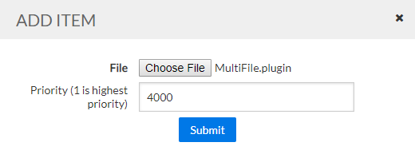

# MultiFile field data plugin

The MultiFile field data plugin is a plugin for AQTS 2018.4-or-newer which can create same-day field visits from data parsed by separate plugins.

Download the latest version of the MultiFile plugin [from the releases page](https://github.com/AquaticInformatics/aquarius-field-data-framework/releases/latest).

If all the data files are combined into a single ZIP archive, this plugin will try parsing the files using all the other plugins installed on the AQTS server.

If each the files within the ZIP archive can be parsed by one the other plugins, then the import will succeed.

This plugin allows you to:
- Go into the field on Wednesday
- Take a discharge measurement using a [FlowTracker2](https://github.com/AquaticInformatics/flowtracker2-field-data-plugin) device, saved as `WednesdayDischarge.ft`
- Take other environmental readings (like Air temperature, and battery voltage), saved in the [StageDischargeReadings CSV format](https://github.com/AquaticInformatics/stage-discharge-readings-field-data-plugin) as 'WednesdayReadings.csv`
- Combine both files into `Wednesday.zip`
- Upload `Wednesday.zip` to AQTS, and see the Wednesday visit with both the discharge measurement and the on-site readings.

## Plugin Compatibility Matrix

The MultiFile field data plugin is tightly coupled to the specific framework version used to build it.

When you install the MultiFile plugin on your AQTS app server, it is recommended that you use the most recent version of the JSON plugin that matches your AQTS server version.

| AQTS Version | Latest compatible plugin Version |
| --- | --- |
| AQTS 2021.3+ | [v21.3.0](https://github.com/AquaticInformatics/aquarius-field-data-framework/releases/download/v21.3.0/MultiFile.plugin) |
| AQTS 2021.2<br/>AQTS 2021.1<br/>AQTS 2020.4<br/>AQTS 2020.3 | [v20.3.10](https://github.com/AquaticInformatics/aquarius-field-data-framework/releases/download/v20.3.10/MultiFile.plugin) |
| AQTS 2020.2 | [v20.2.5](https://github.com/AquaticInformatics/aquarius-field-data-framework/releases/download/v20.2.5/MultiFile.plugin) |
| AQTS 2020.1<br/>AQTS 2019.4 Update 1 | [v19.4.14](https://github.com/AquaticInformatics/aquarius-field-data-framework/releases/download/v19.4.14/MultiFile.plugin) |
| AQTS 2019.4 | [v19.4.0](https://github.com/AquaticInformatics/aquarius-field-data-framework/releases/download/v19.4.0/MultiFile.plugin) |
| AQTS 2019.3 | [v19.3.0](https://github.com/AquaticInformatics/aquarius-field-data-framework/releases/download/v19.3.0/MultiFile.plugin) |
| AQTS 2019.2 | [v19.2.2](https://github.com/AquaticInformatics/aquarius-field-data-framework/releases/download/v19.2.2/MultiFile.plugin) |
| AQTS 2019.1 | [v19.1.0](https://github.com/AquaticInformatics/aquarius-field-data-framework/releases/download/v19.1.0/MultiFile.plugin) |
| AQTS 2018.4 | [v18.4.21](https://github.com/AquaticInformatics/aquarius-field-data-framework/releases/download/v18.4.21/MultiFile.plugin) |

## Install the MultiFile plugin with the highest PluginPriority

It is recommended to install the MultiFile plugin with the highest PluginPriority value,
so that it runs last in the chain, after all other installed plugins get a chance to parse a file.



Normally, when installing a plugin, there is no need to specify a priority, and the server will
install the new plugin at the front of the processing chain, with the lowest `PluginPriority` valute. This is **not** the recommended choice for `MultiFile`, which should be installed at the back of the chain instead.

When the AQTS app server receives a field data file, it will:
- Try each installed plugin, from lowest `PluginPriority` value to highest `PluginPriority` value
- Stop processing when the first plugin returns `SuccessfullyParsedAndDataValid`.

By installing the MultiFile plugin with the largest `PluginPriority` value of all installed plugins, you will minimize conflicts with other installed plugins which may also want to process a ZIP archive.

## Expected layout of ZIP archives

The MultiFile plugin will only process files at the root of the ZIP archive.

Files contained within nested subfolders will not be considered for parsing by other plugins.

The `Wednesday.zip` archive should have a layout like:
```
WednesdayDischarge.ft
WednesdayReadings.csv
```

A ZIP archive like this, with nested folders, will not be parsed by the MultiFile plugin.
```
FlowTracker\WednesdayDischarge.ft
Readings\WednesdayReadings.csv
```
